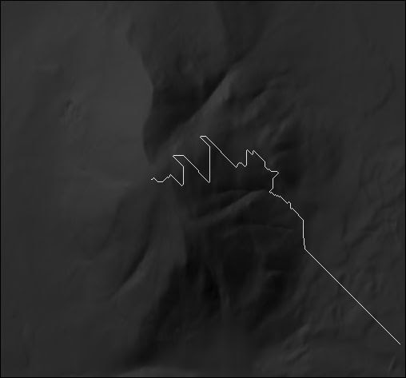

# Breadcrumbs
An algorithmic trail routing system

Building sustainable trails is important. A badly routed trail can cause erosion and damage the environment, and a poor experience for trail users.
Drafting a trail route is generally done by hand, with a GIS mapping application. Breadcrumbs aims to assist with research on how to automatically generate sustainable trail routes. Given elevation data, a set of weights, and zero or more extra map layers, Breadcrumbs will attempt to find the best route across the given terrain.

The algorithm used is a variant of A* search, which searches in three dimensions and performs specially weighted distance calculations as part of its cost function. Other factors in the function include slope and arbitrary additional layers loaded from TIFFs. 
